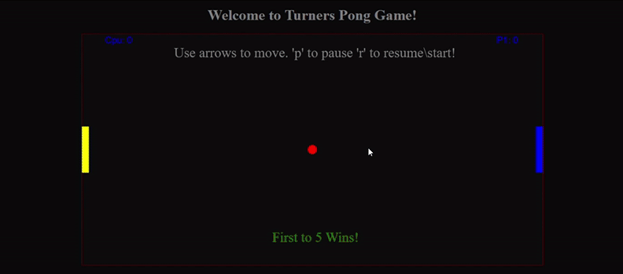
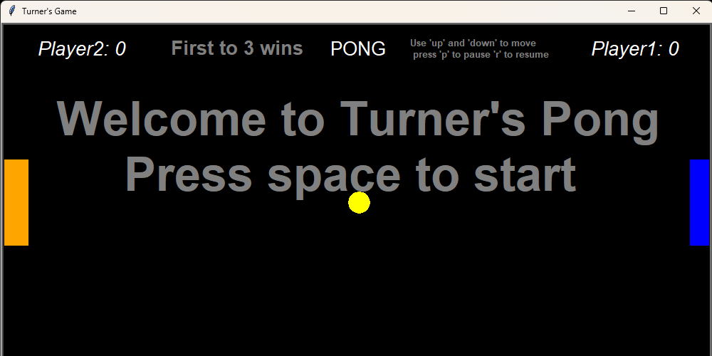

# Turner Inge

## Overview
I am currently a student at Villanova University pursuing a Masters In Software Engineering. I graduated in 3.5 years with a bachelors in Computer Science. I am passionate about coding and exploring new technologies, driven by seeing projects evolve from an idea into a working solution. Whether that is building machine learning models, interactive games, web applications, or anything related to the field. I take joy in the journey of software development. Taking an idea, and seeing it come to life.

***

## Projects
### NFL Game Outcome Predictor 
**Technologies**: Python, Jupyter Notebook, Pandas, Scikit-learn
* Built a machine learning pipeline to predict NFL game winners using 342k+ play-by-play records (2009–2016).

* Aggregated play-level data into team-season averages and engineered matchup features while removing outcome-leaking variables.

* Trained multiple models (Logistic Regression, SVM, MLP, Decision Tree); Logistic Regression achieved 66% accuracy and 0.73 AUC.

* Generated probabilistic predictions for future/hypothetical matchups, with visualizations of feature importance, ROC curves, and confusion matrices.

* [Project Repository](https://github.com/tinge5/finalProjectML)
 
### Slices Puzzle Game

**Technologies**: React, JavaScript, Firestore, CSS

* Developed a web-based puzzle game with timed challenges and a daily leaderboard to track scores and encourage friendly competition.
* Implemented real-time data storage and retrieval with Firestore, enabling dynamic score updates across users.
* Optimized user experience with a responsive, interactive UI.
* [WebLink](https://slicesgame.netlify.app/)
* [Project Repository](https://github.com/CSC4790-Fall2025-Org/section-002-slices)

### Custom Pong Game

**Technologies**: Python (Turtle), HTML/JavaScript (Brython)

* Built a classic Pong game playable in both Python console and browser, showcasing cross-platform development skills.
* Implemented ball/paddle physics, collision detection, scoring, and pause/restart mechanics.
* Demonstrated proficiency in interactive UI, real-time game mechanics, and multiple programming environments.

#### Html version

***
#### Python Version

  
  

